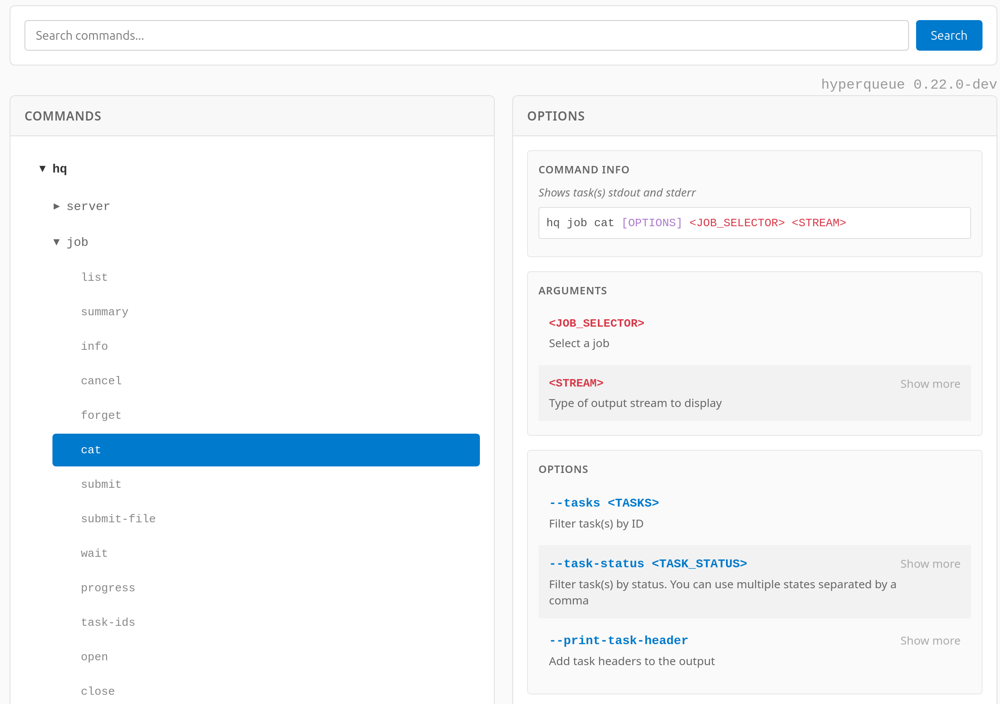

# `cli_doc` - Documentation generator for CLI

`cli_doc` generates HTML documentation for an application's command-line interface. 

`cli_doc` does not need to be compiled with the application; it just needs its executable. It automatically extracts information by (recursively) calling of the application with the `--help` option. 

Currently, `cli_doc` supports only CLIs that are generated by `clap` (or applications with a similar help format).

<p align="center">

</p>


## Examples

### Cargo

```commandline
$ cli_doc cargo
```

Output: [doc.html](docs/cargo.html)


### HyperQueue

Generating documentation for [HyperQueue](https://github.com/It4innovations/hyperqueue)

```commandline
$ cli_doc hq
```

Output: [doc.html](docs/hq.html)

## Installation

```commandline
$ cargo install cli_doc
```
